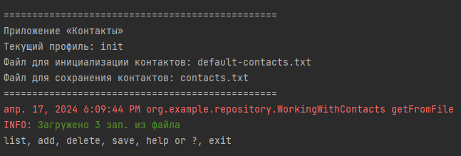

##Контакты: Консольное приложение для управления контактами
**Контакты** - это консольное приложение, разработанное на языке Java, которое позволяет управлять списком контактов.   Приложение предлагает простой и удобный интерфейс для добавления, удаления, просмотра и сохранения контактной информации.
###Функциональность:
* **Просмотр контактов**: Вы можете просмотреть список всех имеющихся контактов, включая ФИО, номер телефона и адрес электронной почты.
* **Добавление контактов**: Новые контакты можно добавить, указав ФИО, номер телефона и адрес электронной почты.
* **Удаление контактов**: Контакты можно удалить, указав адрес электронной почты.
* **Сохранение контактов**: Список контактов сохраняется в текстовый файл для дальнейшего использования.
* **Помощь**: В любой момент вы можете получить информацию о доступных командах и их использовании, набрав help или ?.
###Технологии:
Приложение разработано с использованием следующих технологий:  
* **Java 17**: Язык программирования.
* **Spring Framework**: Фреймворк для управления зависимостями и конфигурации приложения.
* **Lombok**: Библиотека для упрощения написания кода.
* **JUnit 5**: Фреймворк для тестирования.
###Использование:
1. **Запуск приложения**: Запустите файл Main.java, чтобы запустить приложение.
2. **Ввод команд**: После запуска приложения введите одну из следующих команд:
* list: Просмотр списка контактов.
* add: Добавление нового контакта.
* delete: Удаление контакта.
* save: Сохранение списка контактов в файл.
* help или ?: Отображение справки.
* exit: Выход из приложения.
3. **Ввод данных**: После ввода команды следуйте инструкциям на экране для ввода необходимых данных, таких как ФИО, номер телефона и адрес электронной почты.
###Пример использования:
> list

<< Список контактов >>  Всего 3 зап.  
Иванов Иван Иванович | +7 909 999-99-99 | someEmail@example.example   
Смирнов Иван Иванович | +7(909)999 91 11 | someEmail2@example.example  
Голоколенко Иван Иванович | +7(988)4567788 | golIvan@gmail.com 

> add

Input contact: Ivanov Ivan Ivanovich; +7(909) 999-99-00; someEmail@example.example  
: Петров Петр Петрович; +7(900)123-45-67; petrov@mail.ru

Контакт добавлен в список

> list

<< Список контактов >>  Всего 4 зап.  
Иванов Иван Иванович | +7 909 999-99-99 | someEmail@example.example  
Смирнов Иван Иванович | +7(909)999 91 11 | someEmail2@example.example  
Голоколенко Иван Иванович | +7(988)4567788 | golIvan@gmail.com  
Петров Петр Петрович | +7(900)123-45-67 | petrov@mail.ru  

> save

Контакты сохранены в файл: contacts.txt

> exit

###Заключение:
Контакты - это простое и эффективное приложение для управления контактами из командной строки.  
Оно идеально подходит для тех, кто предпочитает использовать консоль или ищет легкое   
в использовании решение для хранения контактной информации.